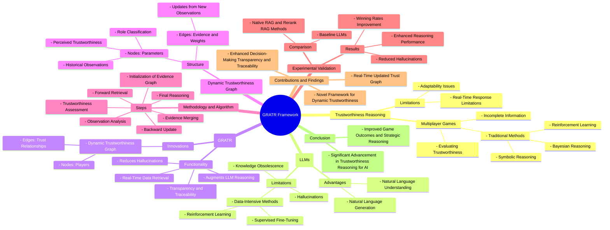

# AdvancedRAGTechniques
This repository contains various RAG patterns implemented from scratch

```mermaid
mindmap
  root((GRATR Framework))
    Trustworthiness Reasoning
      Multiplayer Games
        - Incomplete Information
        - Evaluating Trustworthiness
        - Traditional Methods
          - Bayesian Reasoning
          - Symbolic Reasoning
          - Reinforcement Learning
      Limitations
        - Adaptability Issues
        - Real-Time Response Limitations
      
    Large Language Models (LLMs)
      Advantages
        - Natural Language Understanding
        - Natural Language Generation
      Limitations
        - Hallucinations
        - Knowledge Obsolescence
        - Data-Intensive Methods
          - Supervised Fine-Tuning
          - Reinforcement Learning
      
    Graph Retrieval Augmented Reasoning (GRATR)
      Innovations
        - Dynamic Trustworthiness Graph
          - Nodes: Players
          - Edges: Trust Relationships
      Functionality
        - Real-Time Data Retrieval
        - Augments LLM Reasoning
        - Reduces Hallucinations
        - Transparency and Traceability
      
    Dynamic Trustworthiness Graph
      Structure
        - Nodes: Parameters
          - Perceived Trustworthiness
          - Role Classification
          - Historical Observations
        - Edges: Evidence and Weights
          - Updates from New Observations
      
    Methodology and Algorithm
      Steps
        - Initialization of Evidence Graph
        - Observation Analysis
        - Trustworthiness Assessment
        - Evidence Merging
        - Forward Retrieval
        - Backward Update
        - Final Reasoning
      
    Experimental Validation
      Comparison
        - Baseline LLMs
        - Native RAG and Rerank RAG Methods
      Results
        - Winning Rates Improvement
        - Enhanced Reasoning Performance
        - Reduced Hallucinations
      
    Contributions and Findings
      - Novel Framework for Dynamic Trustworthiness
      - Real-Time Updated Trust Graph
      - Enhanced Decision-Making Transparency and Traceability
      
    Conclusion
      - Significant Advancement in Trustworthiness Reasoning for AI
      - Improved Game Outcomes and Strategic Reasoning

```
