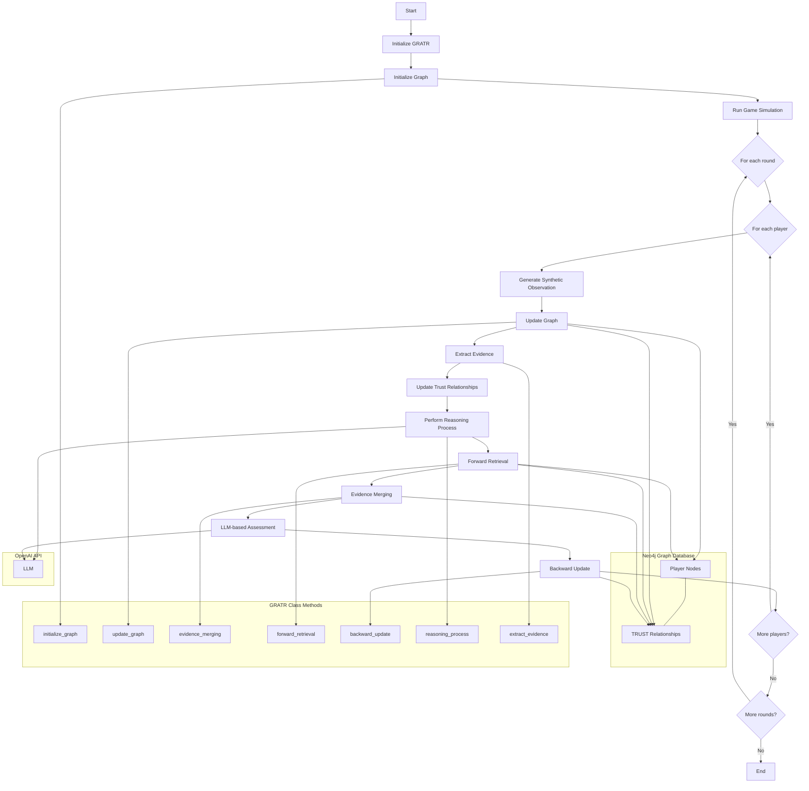

## Architecture Diagram

```mermaid
graph TD
    A[Start] --> B[Initialize GRATR]
    B --> C[Initialize Graph]
    C --> D[Run Game Simulation]
    D --> E{For each round}
    E --> F{For each player}
    F --> G[Generate Synthetic Observation]
    G --> H[Update Graph]
    H --> I[Extract Evidence]
    I --> J[Update Trust Relationships]
    J --> K[Perform Reasoning Process]
    K --> L[Forward Retrieval]
    L --> M[Evidence Merging]
    M --> N[LLM-based Assessment]
    N --> O[Backward Update]
    O --> P{More players?}
    P -->|Yes| F
    P -->|No| Q{More rounds?}
    Q -->|Yes| E
    Q -->|No| R[End]

    subgraph "Neo4j Graph Database"
        S[Player Nodes]
        T[TRUST Relationships]
        S --- T
    end

    subgraph "OpenAI API"
        U[LLM]
    end

    H --> S
    H --> T
    L --> S
    L --> T
    M --> T
    O --> T
    K --> U
    N --> U

    subgraph "GRATR Class Methods"
        V[initialize_graph]
        W[update_graph]
        X[evidence_merging]
        Y[forward_retrieval]
        Z[backward_update]
        AA[reasoning_process]
        AB[extract_evidence]
    end

    C --> V
    H --> W
    M --> X
    L --> Y
    O --> Z
    K --> AA
    I --> AB
```
