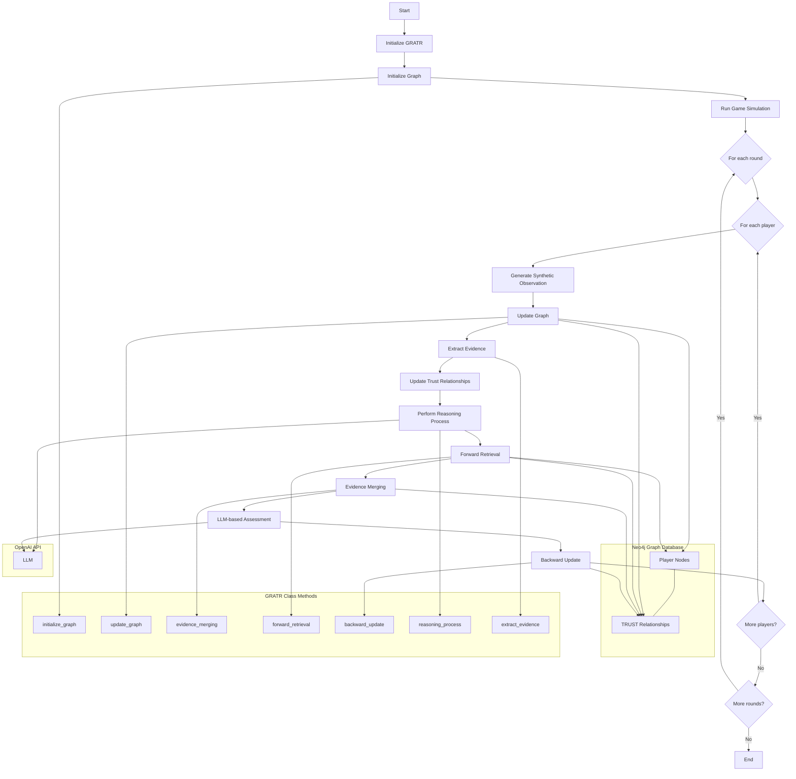

# Disaster Response GRATR

## Graph Retrieval Augmented Trustworthiness Reasoning for Disaster Response Coordination

### Table of Contents
1. [Introduction](#introduction)
2. [Features](#features)
3. [System Architecture](#system-architecture)
4. [Installation](#installation)
5. [Usage](#usage)
6. [Components](#components)
7. [Simulation Process](#simulation-process)
8. [Customization](#customization)
9. [Contributing](#contributing)
10. [License](#license)

## Introduction

Disaster Response GRATR is an innovative system that applies Graph Retrieval Augmented Trustworthiness Reasoning (GRATR) to enhance coordination and decision-making in disaster response scenarios. By leveraging graph-based trust modeling and machine learning techniques, this system provides a dynamic and adaptive approach to assessing trustworthiness and potential for coordination among multiple agencies involved in disaster response efforts.

## Features

- Dynamic trust graph representation of agencies and their relationships
- Real-time updates based on agency actions and interactions
- Integration with Large Language Models (LLMs) for natural language processing of reports and assessments
- Comprehensive simulation of disaster response scenarios
- Detailed agency profiles including resources, specialized units, and historical performance
- Integration of external factors such as disaster events and media coverage

## System Architecture

The Disaster Response GRATR system consists of the following key components:

1. **Graph Database (Neo4j)**: Stores the trust network, agency information, and disaster-related data.
2. **GRATR Algorithm**: Implements the core logic for trust assessment and evidence processing.
3. **Large Language Model Integration**: Utilizes OpenAI's GPT models for natural language understanding and generation.
4. **Simulation Engine**: Generates and runs disaster response scenarios.
5. **Analysis and Visualization Tools**: Provides insights into trust dynamics and agency performance.

## Installation

1. Clone the repository:
   ```
   git clone https://github.com/yourusername/disaster-response-gratr.git
   cd disaster-response-gratr
   ```

2. Install required dependencies:
   ```
   pip install -r requirements.txt
   ```

3. Set up Neo4j:
   - [Download and install Neo4j](https://neo4j.com/download/)
   - Create a new database and note down the URI, username, and password

4. Set up environment variables:
   - Create a `.env` file in the project root
   - Add the following variables:
     ```
     NEO4J_URI=bolt://localhost:7687
     NEO4J_USERNAME=your_username
     NEO4J_PASSWORD=your_password
     OPENAI_API_KEY=your_openai_api_key
     ```

## Usage

To run a simulation:

```python
from disaster_response_gratr import DisasterResponseGRATR

# Initialize the system
gratr = DisasterResponseGRATR(num_agencies=5)

# Run a simulation
gratr.simulate_disaster_response(num_rounds=3)
```

## Components

### 1. Agency Nodes
Represent disaster response agencies with properties such as type, location, budget, staff count, and performance metrics.

### 2. Disaster Nodes
Represent specific disaster events with properties like type, date, and severity.

### 3. Resource Nodes
Represent various resources available for disaster response, linked to agencies that possess them.

### 4. News Channel Nodes
Represent media entities covering disaster events, providing an additional layer of information flow.

### 5. Specialized Unit Nodes
Represent specific capabilities of agencies, such as search and rescue teams or hazmat units.

### 6. Trust Relationships
Dynamic edges between agency nodes, updated based on interactions and performance during disaster response.

## Simulation Process

1. **Graph Enhancement**: Populates the graph with detailed agency and disaster information.
2. **Disaster Generation**: Randomly selects a disaster type for each round of the simulation.
3. **Agency Actions**: Simulates actions taken by each agency in response to the disaster.
4. **Graph Updates**: Modifies trust relationships based on agency actions and interactions.
5. **Evidence Extraction**: Processes action reports to extract structured evidence.
6. **Trust Assessment**: Updates trust scores between agencies based on extracted evidence.
7. **Coordination Assessment**: Evaluates potential for coordination between agencies based on trust scores and historical data.

## Customization

The system is designed to be flexible and customizable:

- Modify the `enhance_graph` method to add or change agency properties.
- Extend the `extract_evidence` method to handle more complex action reports.
- Adjust the trust update logic in `update_graph` to reflect different trust dynamics.
- Add new node types or relationships to represent additional aspects of disaster response.

## Contributing

Contributions to the Disaster Response GRATR project are welcome! Please refer to the `CONTRIBUTING.md` file for guidelines on how to submit issues, feature requests, and pull requests.

## License

This project is licensed under the MIT License - see the `LICENSE` file for details.

---

For more information or support, please open an issue in the GitHub repository or contact the project maintainers.


## Architecture Diagram


