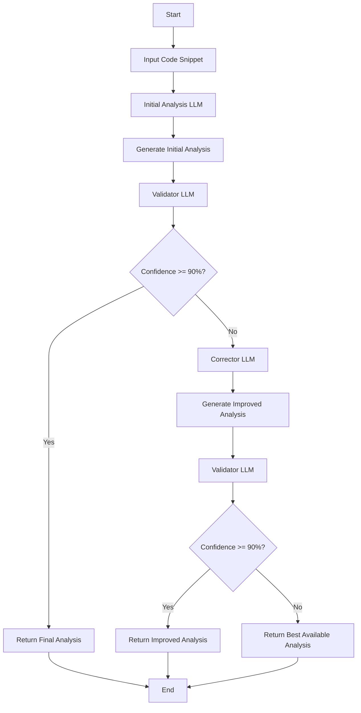

### Logical Flow Diagram

```mermaid
flowchart TD
    A[Start] --> B[Input Code Snippet]
    B --> C[Initial Analysis LLM]
    C --> D[Generate Initial Analysis]
    D --> E[Validator LLM]
    E --> F{Confidence >= 90%?}
    F -->|Yes| G[Return Final Analysis]
    F -->|No| H[Corrector LLM]
    H --> I[Generate Improved Analysis]
    I --> J[Validator LLM]
    J --> K{Confidence >= 90%?}
    K -->|Yes| L[Return Improved Analysis]
    K -->|No| M[Return Best Available Analysis]
    G --> N[End]
    L --> N
    M --> N

```
