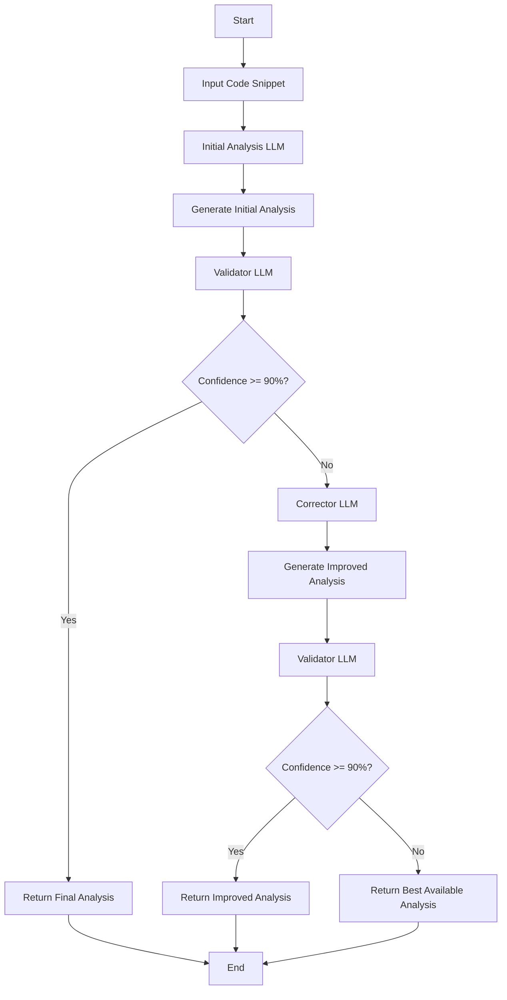

# Reflection-Tuned Code Analyzer

## Overview

The Reflection-Tuned Code Analyzer is an advanced AI-driven tool that leverages an extended reflection prompting technique to provide high-quality code analysis. By mimicking human expert thought processes, this system offers thorough, self-correcting code reviews with confidence-based decision making.

## Key Features

1. **Multi-Stage Analysis**: Utilizes a three-step process of initial analysis, validation, and potential correction, mimicking a human expert's approach to code review.

2. **Confidence-Based Decision Making**: Employs a validator LLM to assign a confidence score after each analysis stage, determining whether the result is satisfactory or requires further improvement.

3. **Self-Correction Mechanism**: When the confidence score is below the threshold, a dedicated corrector LLM improves the initial analysis based on the validator's feedback.

4. **Flexible Application**: While designed for code analysis, this reflection prompting technique can be adapted for various complex tasks requiring deep analysis and self-reflection in AI systems.

## Installation

```bash
git clone https://github.com/yourusername/reflection-tuned-code-analyzer.git
cd reflection-tuned-code-analyzer
pip install -r requirements.txt
```

## Logical Flow Diagram


## Usage

Here's a basic example of how to use the Reflection-Tuned Code Analyzer:

```python
from code_analyzer import ReflectionTunedAnalyzer

analyzer = ReflectionTunedAnalyzer()

code_snippet = """
def factorial(n):
    if n == 0:
        return 1
    else:
        return n * factorial(n-1)

def main():
    num = input("Enter a number: ")
    result = factorial(num)
    print(f"The factorial of {num} is {result}")

if __name__ == "__main__":
    main()
"""

analysis_result = analyzer.analyze(code_snippet)
print(analysis_result)
```

## How It Works

1. **Initial Analysis**: An LLM performs the first pass of code analysis.
2. **Validation**: A separate validator LLM assesses the analysis and assigns a confidence score.
3. **Correction (if needed)**: If the confidence score is below 90%, a corrector LLM improves the analysis.
4. **Final Validation**: The improved analysis is re-validated to ensure high-quality output.

## Contributing

We welcome contributions to the Reflection-Tuned Code Analyzer! Please read our [CONTRIBUTING.md](CONTRIBUTING.md) for details on our code of conduct and the process for submitting pull requests.

## License

This project is licensed under the MIT License - see the [LICENSE.md](LICENSE.md) file for details.

## Acknowledgments

- This project builds upon the reflection prompting technique, extending it for specialized code analysis.
- Special thanks to the open-source AI community for their ongoing contributions to language model advancements.


