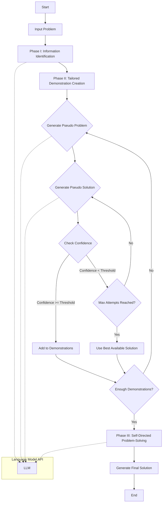

# SELF-TAUGHT Algorithm

SELF-TAUGHT is an innovative algorithm designed to enhance problem-solving capabilities of Large Language Models (LLMs) through self-generated, tailored demonstrations.

## Algorithm Overview

1. **Input**: A problem or question to be solved.

2. **Phase I: Information Identification**
   - Analyzes the input problem to identify key information and knowledge required for solving.
   - Produces an abstract representation of the necessary information.

3. **Phase II: Tailored Demonstration Creation**
   - Generates pseudo-problems related to the identified information.
   - Creates solutions for these pseudo-problems.
   - Implements a confidence-based filtering mechanism to ensure high-quality demonstrations.

4. **Phase III: Self-Directed Problem-Solving**
   - Uses the generated demonstrations to guide the solution process for the original problem.
   - Produces a final solution based on the insights from the tailored demonstrations.

## Key Features

- **Self-Generation**: Creates its own examples and solutions, reducing reliance on pre-existing demonstrations.
- **Tailored Approach**: Generates demonstrations specific to each input problem, ensuring relevance.
- **Quality Control**: Employs a confidence scoring system to filter and select high-quality demonstrations.
- **Flexibility**: Can be implemented with various types of LLMs and APIs.
- **Zero-Shot Capability**: Operates without the need for task-specific training or fine-tuning.

## How It Works

1. The algorithm receives a problem as input.
2. It identifies the core information and knowledge areas relevant to the problem.
3. Based on this information, it generates a set of related pseudo-problems.
4. For each pseudo-problem, it creates a solution and assigns a confidence score.
5. High-confidence solutions are collected as demonstrations.
6. Using these tailored demonstrations, the algorithm then approaches the original problem.
7. Finally, it generates a solution to the original problem, leveraging insights from the demonstrations.

## Benefits

- Enhances problem-solving capabilities of LLMs across various domains.
- Reduces the need for manually crafted demonstrations or extensive datasets.
- Adapts to each unique problem, potentially improving accuracy and relevance of solutions.
- Can be applied to a wide range of question-answering and problem-solving tasks.

## Potential Applications

- Complex question-answering systems
- Tutoring and educational tools
- Research assistance and hypothesis generation
- Creative writing and ideation support
- Technical problem-solving in specialized domains

## Implementation Considerations

- Requires integration with a capable LLM or API.
- Performance may vary based on the underlying language model's capabilities.
- Proper prompt engineering is crucial for effective information identification and demonstration generation.
- Consider computational resources, as the algorithm involves multiple LLM calls per problem.

## Architecture Diagram

